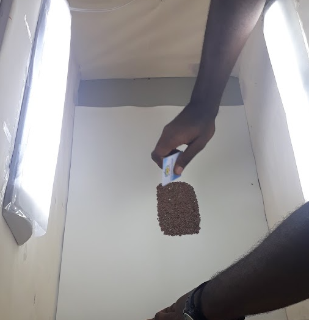
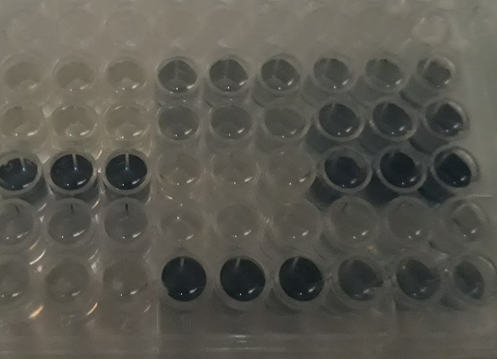
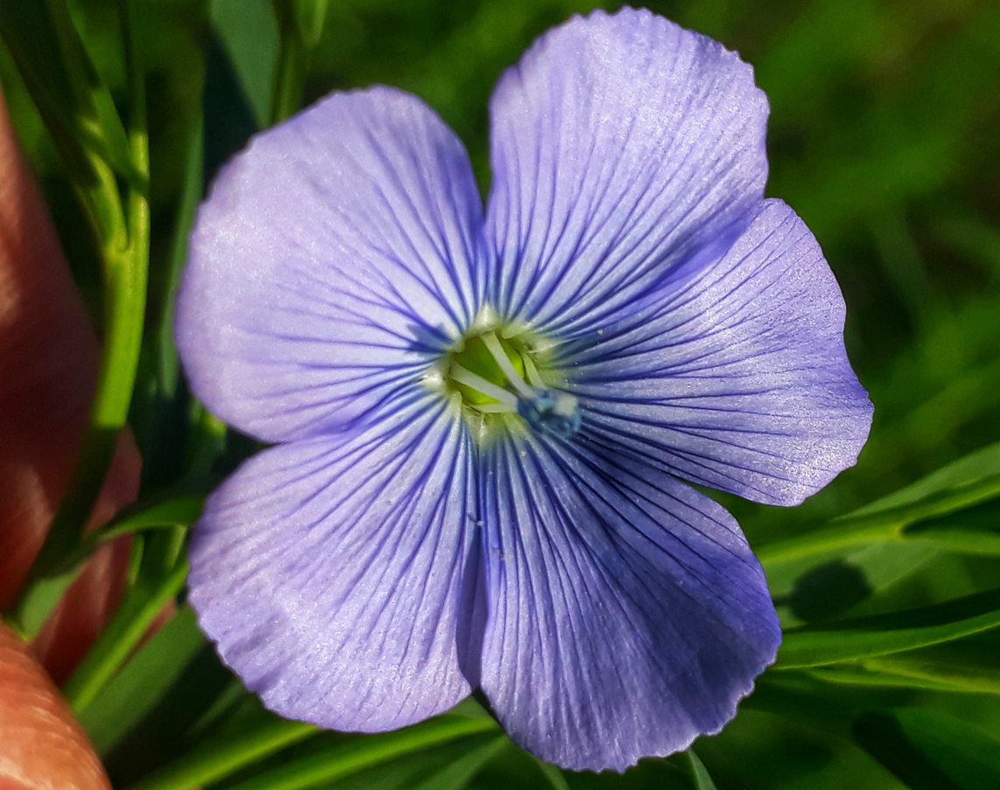
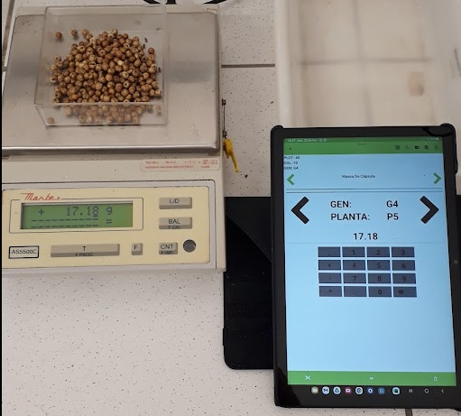
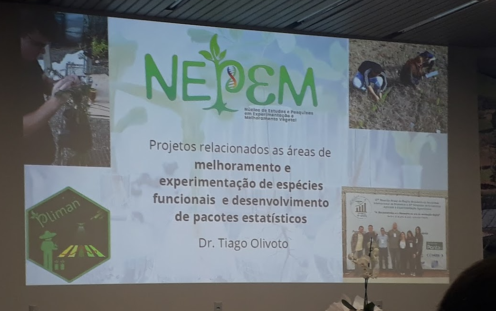
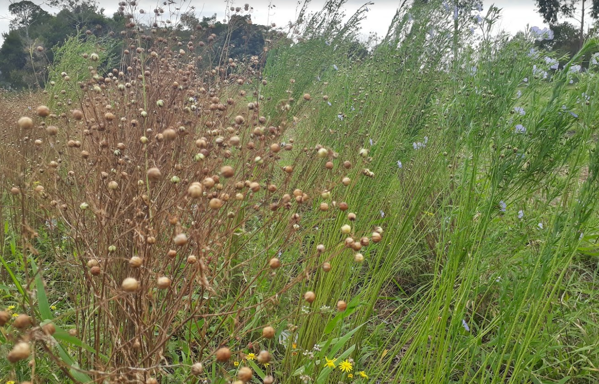
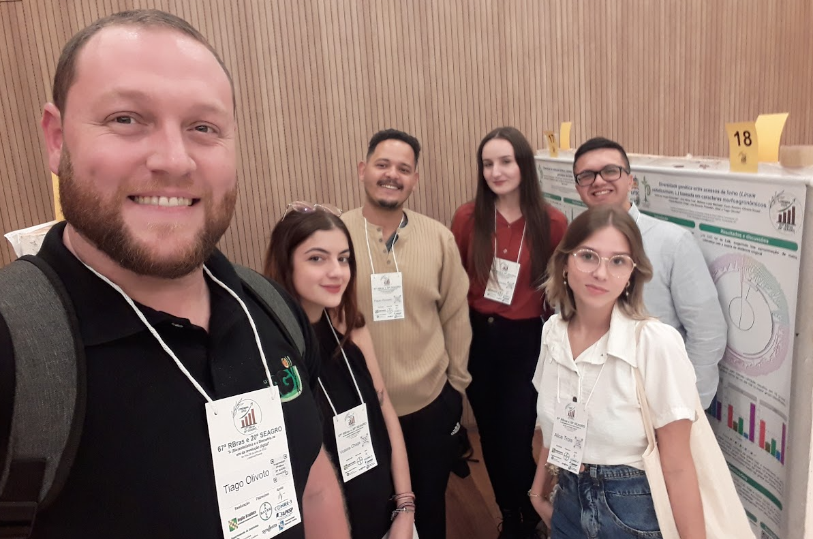

---
authors:
- admin
bio: Somos um grupo de pesquisa da UFSC dedicado ao melhoramento genético de plantas, experimentação de campo, e fenotipagem digital de alto rendimento. Com foco na formação de recursos humanos qualificados, impulsionamos a agricultura sustentável através de tecnologia e ciência aplicada.
email: "nepem.ufsc@gmail.com"
name: NEPEM/UFSC
organizations:
- name: UFSC
  url: "https://ufsc.br/"
role: NEPEM

social:
- icon: envelope
  icon_pack: fas
  link: '#contact'
  
- icon: researchgate
  icon_pack: ai
  link: https://www.researchgate.net/lab/NEPEM-Tiago-Olivoto

- icon: github
  icon_pack: fab
  link: https://github.com/NEPEM-UFSC
  
- icon: linkedin-in
  icon_pack: fab
  link: https://www.linkedin.com/company/nepem-n%C3%BAcleo-de-estudos-e-pesquisas-em-experimenta%C3%A7%C3%A3o-e-melhoramento-vegetal/?viewAsMember=true
  
superuser: true
---

Bem-vindo ao site do **Núcleo de Estudos e Pesquisas em Experimentação e Melhoramento Vegetal** -- NEPEM. O NEPEM é um Núcleo vinculado ao [Departamento de Fitotecnia](https://fit.ufsc.br/) do [Centro de Ciências Agrárias](https://cca.ufsc.br/) da [Universidade Federal de Santa Catarina](https://ufsc.br/), *campus* Florianópolis.

Nosso núcleo é dedicado ao melhoramento genético e à experimentação de campo de linhaça na costa sul do Brasil. Também nos destacamos no desenvolvimento de aplicativos e modelos de fenotipagem digital de alto rendimento, utilizando Inteligência Artificial, Sensoriamento Proximal e Remoto.

<!-- Include the CSS and JS files -->
<link rel="stylesheet" href="css/styles.css">

<!-- HTML Carousel Code -->

    

        

            
        

        

            
        

        

            
        

        

            
        

        

            
        

        

            
        

        

            
        

        

            
        

        

            
        

        

            
        

        

            
        

        

            
        

        

            
        

    

    <button class="carousel-control prev" onclick="prevSlide()">❮</button>
    <button class="carousel-control next" onclick="nextSlide()">❯</button>

<!-- 

  <a href="#link1" style="background-color: #28a745; color: white; padding: 20px 80px; text-decoration: none; border-radius: 40px; display: inline-block; font-size: 16px; font-weight: bold; box-shadow: 0 4px 8px rgba(0, 0, 0, 0.2); transition: all 0.3s ease;" onmouseover="this.style.backgroundColor='#218838'; this.style.boxShadow='0 6px 12px rgba(0, 0, 0, 0.3)';" onmouseout="this.style.backgroundColor='#28a745'; this.style.boxShadow='0 4px 8px rgba(0, 0, 0, 0.2)';">
    Button 1
  </a>
  <a href="#link2" style="background-color: #007bff; color: white; padding: 20px 80px; text-decoration: none; border-radius: 40px; display: inline-block; font-size: 16px; font-weight: bold; box-shadow: 0 4px 8px rgba(0, 0, 0, 0.2); transition: all 0.3s ease;" onmouseover="this.style.backgroundColor='#0056b3'; this.style.boxShadow='0 6px 12px rgba(0, 0, 0, 0.3)';" onmouseout="this.style.backgroundColor='#007bff'; this.style.boxShadow='0 4px 8px rgba(0, 0, 0, 0.2)';">
    Button 2
  </a>
  <a href="#link3" style="background-color: #ff851b; color: white; padding: 20px 80px; text-decoration: none; border-radius: 40px; display: inline-block; font-size: 16px; font-weight: bold; box-shadow: 0 4px 8px rgba(0, 0, 0, 0.2); transition: all 0.3s ease;" onmouseover="this.style.backgroundColor='#e07b1a'; this.style.boxShadow='0 6px 12px rgba(0, 0, 0, 0.3)';" onmouseout="this.style.backgroundColor='#ff851b'; this.style.boxShadow='0 4px 8px rgba(0, 0, 0, 0.2)';">
    Button 3
  </a>

-->
